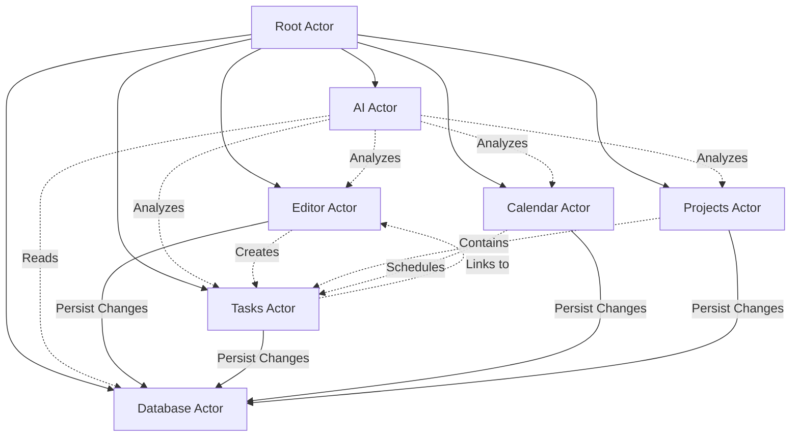
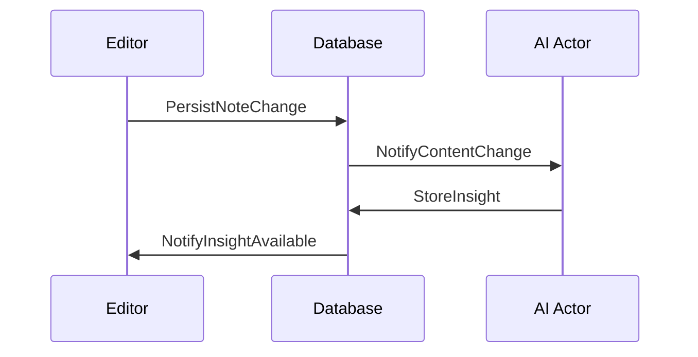
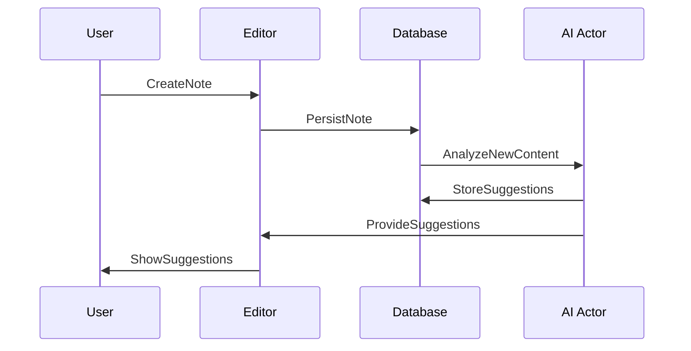
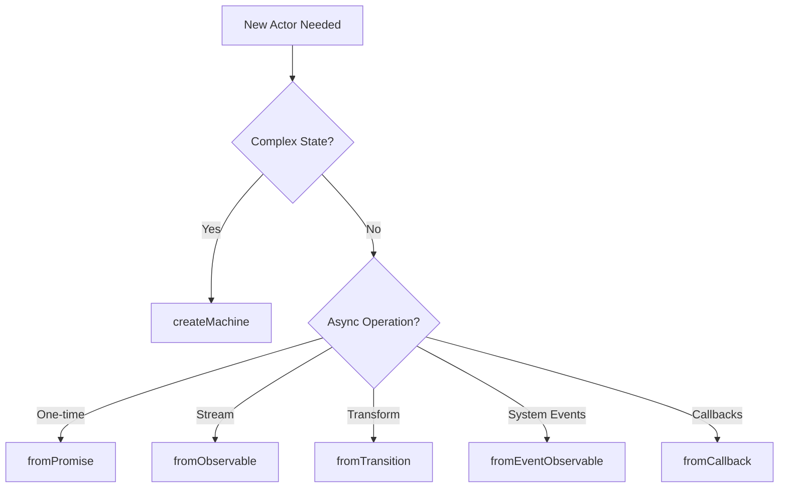

# Kronos Actor System

## Core Principles

Actors in Kronos are organized around major system responsibilities rather than just features. Each actor should:
- Have a clear, single responsibility
- Maintain its own state
- Communicate with other actors through messages
- Be independent and isolated

## Actor Architecture



## Actor Responsibilities

### 1. Root Actor
- System orchestration
- Actor lifecycle management
- Global state coordination

### 2. Editor Actor
- Manages note editing state
- Handles TipTap integration
- Processes real-time content updates
- Extracts semantic content
- Manages note metadata

### 3. Database Actor
- Single source of truth for data
- Handles all database operations
- Manages data migrations
- Ensures data consistency
- Emits change events

### 4. AI Actor
- Independent analysis and insights
- Pattern recognition across all data
- Suggestion generation
- Learning from user behavior
- Maintains context understanding

### 5. Tasks Actor
- Task lifecycle management
- Task prioritization
- Due date handling
- Task relationships

### 6. Calendar Actor
- Time-based organization
- Schedule management
- Time block allocation
- Temporal relationships

### 7. Projects Actor
- Project organization
- Project hierarchy
- Resource allocation
- Progress tracking

## Communication Patterns



## State Management Philosophy

1. **Hierarchical Organization**
   - Root actor coordinates high-level state
   - Child actors manage domain-specific state
   - Clear parent-child relationships

2. **Message-Based Communication**
   - Actors communicate through messages
   - No direct state sharing
   - Clear message contracts

3. **Independent Processing**
   - Each actor processes its own tasks
   - Asynchronous operation
   - Failure isolation

## AI Integration Strategy

The AI Actor is independent because:
1. It needs to analyze patterns across all features
2. Its processing shouldn't block other operations
3. It maintains its own learning state
4. It can be upgraded/modified independently
5. It can be disabled without affecting core functionality

## Example: Note Creation Flow



## Actor Scaling Considerations

1. **Vertical Scaling**
   - Actors can spawn child actors for subtasks
   - Example: Editor spawning multiple note editors

2. **Horizontal Scaling**
   - Actors can be distributed (future consideration)
   - Independent state allows for easy distribution

## Actor Types and Decision Making

### Types of Actors

XState provides several types of actors, each suited for different use cases:

1. **State Machine Actors** (`createMachine`)
   - Complex state management
   - Multiple states and transitions
   - State history needed
   ```typescript
   const editorActor = createMachine({
     states: {
       idle: {},
       editing: {},
       saving: {}
     }
   });
   ```

2. **Promise Actors** (`fromPromise`)
   - One-time async operations
   - Simple data fetching
   - File operations
   ```typescript
   const noteLoader = fromPromise(async ({ noteId }) => {
     return await db.getNoteById(noteId);
   });
   ```

3. **Observable Actors** (`fromObservable`)
   - Continuous data streams
   - Real-time updates
   - WebSocket connections
   ```typescript
   const aiSuggestions = fromObservable(() => {
     return new Observable((subscriber) => {
       // AI processing stream
     });
   });
   ```

4. **Transition Actors** (`fromTransition`)
   - Simple event transformations
   - Input processing
   - When state machines are overkill
   ```typescript
   const searchActor = fromTransition((state, event) => {
     if (event.type === 'SEARCH') {
       return { query: event.value };
     }
   });
   ```

5. **Event Observable Actors** (`fromEventObservable`)
   - DOM events
   - System events
   - Hardware events
   ```typescript
   const keyboardActor = fromEventObservable(() => 
     fromEvent(document, 'keydown')
   );
   ```

6. **Callback Actors** (`fromCallback`)
   - Legacy callback APIs
   - Node.js events
   - Cleanup requirements
   ```typescript
   const fsWatcherActor = fromCallback(({ sendBack }) => {
     const watcher = fs.watch('./notes', (event, filename) => {
       sendBack({ type: 'FILE_CHANGED', filename });
     });
     return () => watcher.close();
   });
   ```

### Decision Flow



### Actor Usage in Kronos

#### Editor System
- **Main Editor**: `createMachine` (complex state)
- **Content Loader**: `fromPromise` (file loading)
- **Auto-save**: `fromObservable` (periodic saves)
- **Input Processing**: `fromTransition` (content transforms)

#### AI System
- **AI Core**: `createMachine` (complex state)
- **Analysis Stream**: `fromObservable` (continuous processing)
- **Model Loading**: `fromPromise` (initial setup)

#### Database System
- **DB Core**: `createMachine` (connection state)
- **Queries**: `fromPromise` (data operations)
- **Change Stream**: `fromObservable` (real-time updates)

## Actor Implementation Guide

### Setting Up a Typed Actor

1. **Define Types First**
```typescript
// Event Types
type SaveNoteEvent = { type: 'SAVE_NOTE'; payload: Pick<Note, 'id' | 'content'> };
type GetNoteEvent = { type: 'GET_NOTE'; payload: { id: string } };

// Union of all events
type DBEvents = 
  | { type: 'INIT' }
  | SaveNoteEvent
  | { type: 'GET_NOTES' }
  | GetNoteEvent;

// Input Types for actors
type SaveNoteInput = Pick<Note, 'id' | 'content'>;
type GetNoteInput = { id: string };

// Context Type
type DBContext = {
  db: Database | null;
  notes: Note[];
  error: Error | null;
};
```

2. **Create Promise Actors with Proper Types**
```typescript
const saveNote = fromPromise<void, SaveNoteInput>(async ({ input }) => {
  if (!input) throw new Error('No input provided');
  const { id, content } = input;
  
  const db = await Database.load('sqlite:kronos.db');
  await db.execute(
    `INSERT INTO notes (id, content) VALUES ($1, $2)`,
    [id, content]
  );
});
```

3. **Setup Machine with Types**
```typescript
export const dbMachine = setup({
  types: {
    context: {} as DBContext,
    events: {} as DBEvents,
  },
  actors: {
    saveNote,
    getNotes,
    getNote
  }
}).createMachine({
  // machine definition
});
```

### State Machine Best Practices

1. **State Organization**
   - Each operation should have its own state
   - States should be named after what they're doing
   - States should handle both success and error cases
   ```typescript
   states: {
     idle: {
       on: { INIT: 'connecting' }
     },
     connecting: {
       invoke: {
         src: 'initDB',
         onDone: 'ready',
         onError: 'error'
       }
     }
   }
   ```

2. **Actor Invocation**
   - Invoke actors in their own states
   - Always handle both success and error cases
   - Type the input properly
   ```typescript
   saving: {
     invoke: {
       src: 'saveNote',
       input: ({ event }) => {
         const e = event as SaveNoteEvent;
         return e.payload;
       },
       onDone: 'ready',
       onError: {
         target: 'error',
         actions: ({ context, event }) => {
           context.error = event.error instanceof Error 
             ? event.error 
             : new Error('Unknown error');
         }
       }
     }
   }
   ```

3. **Error Handling**
   - Always type check errors
   - Provide fallback error messages
   - Store errors in context for UI feedback
   ```typescript
   onError: {
     target: 'error',
     actions: ({ context, event }) => {
       if (event.error instanceof Error) {
         context.error = event.error;
       } else {
         context.error = new Error('Unknown error');
       }
     }
   }
   ```

4. **State Transitions**
   - Keep transitions simple and clear
   - Use intermediate states for operations
   - Return to a stable state after operations
   ```typescript
   ready: {
     on: {
       SAVE_NOTE: 'saving',
       GET_NOTES: 'getting_notes',
       GET_NOTE: 'getting_note'
     }
   }
   ```

### Testing Actors

1. **Unit Testing Promise Actors**
```typescript
test('saveNote actor', async () => {
  const result = await saveNote.transition(undefined, {
    input: { id: '1', content: 'test' }
  });
  expect(result.output).toBeDefined();
});
```

2. **Testing State Machines**
```typescript
test('db machine transitions', () => {
  const machine = createActor(dbMachine);
  machine.start();
  
  machine.send({ type: 'INIT' });
  expect(machine.getSnapshot().value).toBe('connecting');
  
  // Test successful connection
  machine.send({ 
    type: 'xstate.done.actor.connecting', 
    output: mockDb 
  });
  expect(machine.getSnapshot().value).toBe('ready');
});
```

## Example: Note Creation Flow


