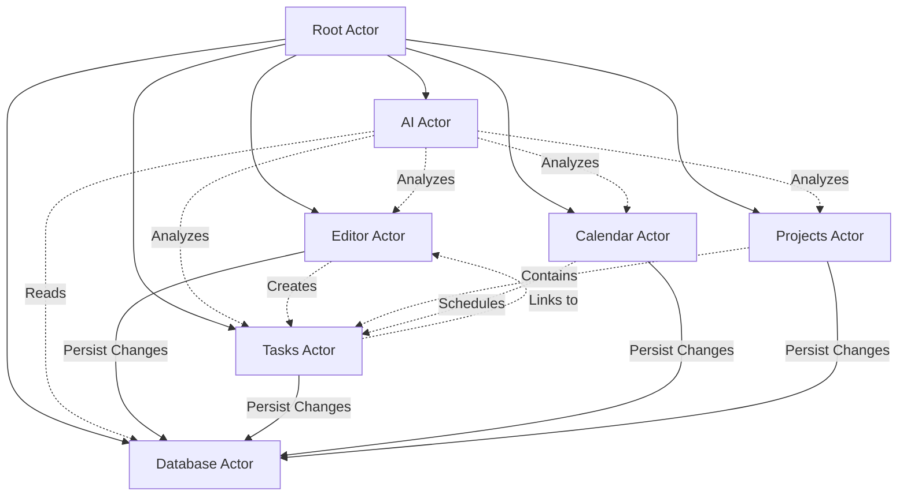
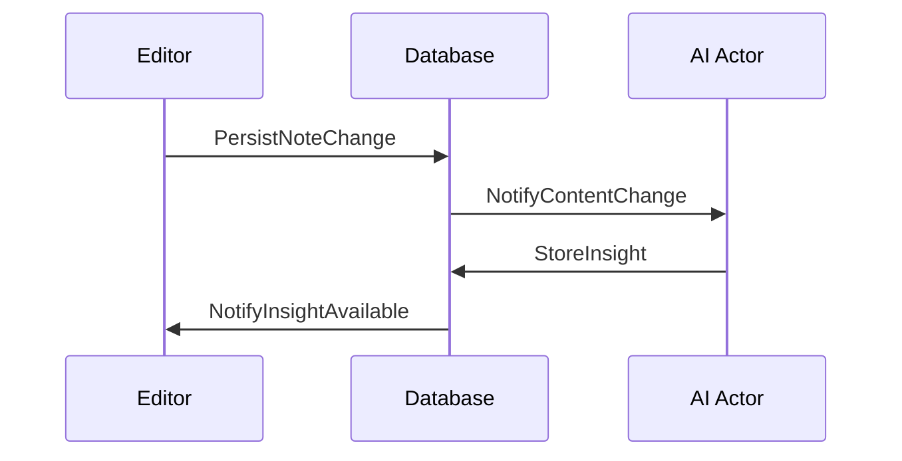
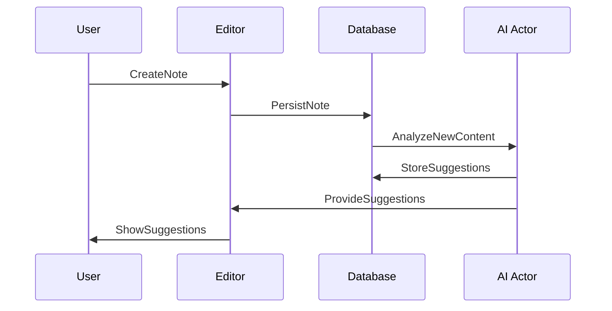

# Kronos Actor System

## Core Principles

Actors in Kronos are organized around major system responsibilities rather than just features. Each actor should:
- Have a clear, single responsibility
- Maintain its own state
- Communicate with other actors through messages
- Be independent and isolated

## Actor Architecture

## Actor Responsibilities

### 1. Root Actor
- System orchestration
- Actor lifecycle management
- Global state coordination

### 2. Editor Actor
- Manages note editing state
- Handles TipTap integration
- Processes real-time content updates
- Extracts semantic content
- Manages note metadata

### 3. Database Actor
- Single source of truth for data
- Handles all database operations
- Manages data migrations
- Ensures data consistency
- Emits change events

### 4. AI Actor
- Independent analysis and insights
- Pattern recognition across all data
- Suggestion generation
- Learning from user behavior
- Maintains context understanding

### 5. Tasks Actor
- Task lifecycle management
- Task prioritization
- Due date handling
- Task relationships

### 6. Calendar Actor
- Time-based organization
- Schedule management
- Time block allocation
- Temporal relationships

### 7. Projects Actor
- Project organization
- Project hierarchy
- Resource allocation
- Progress tracking

## Communication Patterns

## State Management Philosophy

1. **Hierarchical Organization**
   - Root actor coordinates high-level state
   - Child actors manage domain-specific state
   - Clear parent-child relationships

2. **Message-Based Communication**
   - Actors communicate through messages
   - No direct state sharing
   - Clear message contracts

3. **Independent Processing**
   - Each actor processes its own tasks
   - Asynchronous operation
   - Failure isolation

## AI Integration Strategy

The AI Actor is independent because:
1. It needs to analyze patterns across all features
2. Its processing shouldn't block other operations
3. It maintains its own learning state
4. It can be upgraded/modified independently
5. It can be disabled without affecting core functionality

## Example: Note Creation Flow

## Actor Scaling Considerations

1. **Vertical Scaling**
   - Actors can spawn child actors for subtasks
   - Example: Editor spawning multiple note editors

2. **Horizontal Scaling**
   - Actors can be distributed (future consideration)
   - Independent state allows for easy distribution
