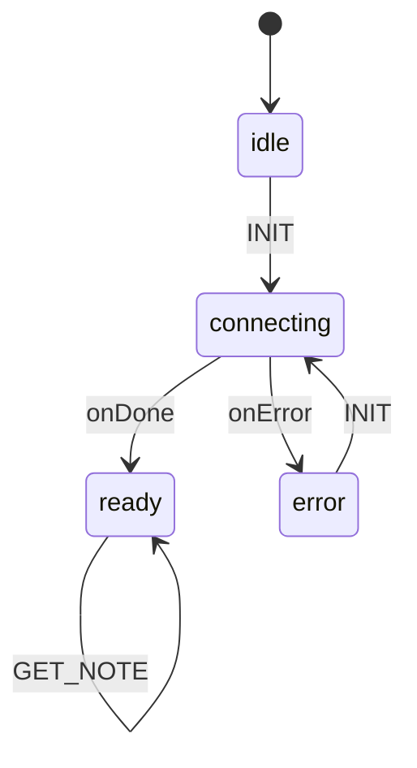

# Database Actor

The database actor is responsible for managing all database operations in Kronos. It provides a thin wrapper around Tauri SQL (which uses SQLx under the hood) and manages the database connection state using XState.

## States

The actor has four main states:

- `idle`: Initial state before database initialization
- `connecting`: State during database connection and table creation
- `ready`: Main operational state where database operations can be performed
- `error`: Error state when database operations fail



## Events

### INIT
Initializes the database connection and creates necessary tables.

```typescript
actor.send('INIT')
```

### SAVE_NOTE
Saves or updates a note in the database.

```typescript
actor.send({
  type: 'SAVE_NOTE',
  payload: {
    id: string,    // Unique identifier for the note
    content: string // Note content
  }
})
```

### GET_NOTES
Retrieves all notes, ordered by last update time.

```typescript
actor.send('GET_NOTES')
```

### GET_NOTE
Retrieves a specific note by ID.

```typescript
actor.send({
  type: 'GET_NOTE',
  payload: {
    id: string // ID of the note to retrieve
  }
})
```

## Database Schema

### Notes Table

| Column      | Type      | Description                    |
|-------------|-----------|--------------------------------|
| id          | TEXT      | Primary key                    |
| content     | TEXT      | Note content                   |
| created_at  | TIMESTAMP | Creation timestamp             |
| updated_at  | TIMESTAMP | Last modification timestamp    |

## Usage Example

```typescript
import { interpret } from 'xstate';
import { dbMachine } from '../actors/db';

// Create and start the actor
const dbActor = interpret(dbMachine);
dbActor.start();

// Initialize database
dbActor.send('INIT');

// Save a note
dbActor.send({
  type: 'SAVE_NOTE',
  payload: {
    id: 'note-1',
    content: 'Hello, World!'
  }
});

// Get all notes
dbActor.send('GET_NOTES');

// Get specific note
dbActor.send({
  type: 'GET_NOTE',
  payload: {
    id: 'note-1'
  }
});
```

## Implementation Details

The database actor uses SQLite through Tauri SQL for data persistence. It automatically creates the required tables on initialization and handles both inserts and updates through `INSERT OR REPLACE` statements.

All database operations are performed asynchronously, and the actor maintains the database connection state throughout the application lifecycle.
