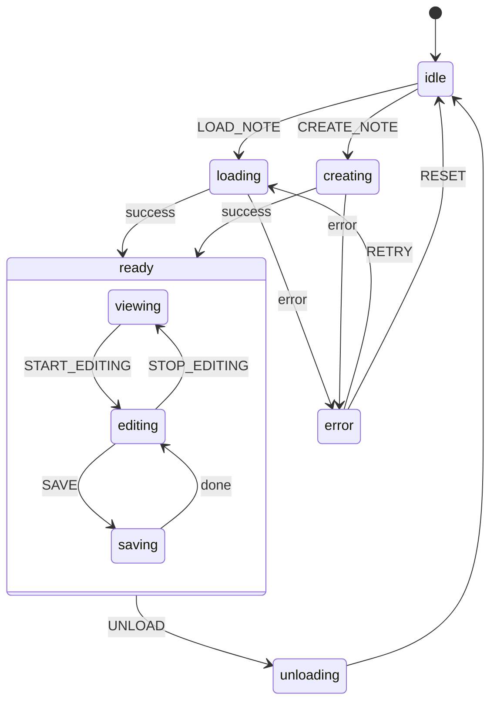

# Editor Actor

## Overview

The Editor Actor manages the lifecycle and state of note editing in Kronos. It handles everything from loading notes to managing content changes and auto-saving.

## State Machine Design

### Context

```typescript
interface EditorContext {
  noteId: string | null;
  content: string;
  editor: TiptapEditor | null;
  noteType: 'daily' | 'document' | 'weekly' | 'monthly';
  isDirty: boolean;
  lastSaved: number;
  properties: Record<string, any>;
  links: Array<{ id: string, type: 'direct' | 'backlink' }>;
}
```

### State Diagram



## States Description

### 1. `idle`
- Initial state
- No note loaded
- Waiting for `LOAD_NOTE` or `CREATE_NOTE` events

### 2. `loading`
- Loading existing note content
- Fetching note metadata and links
- Transitioning to `ready` on success

### 3. `creating`
- Creating new note
- Initializing note structure
- Setting up initial metadata

### 4. `ready`
Contains substates:
- **viewing**: Read-only mode
- **editing**: Active editing with auto-save
- **saving**: Persisting changes

### 5. `error`
- Error handling state
- Provides retry capabilities
- Shows error messages

### 6. `unloading`
- Cleanup state
- Ensures proper resource disposal
- Saves pending changes

## Events

1. **LOAD_NOTE**
   ```typescript
   {
     type: 'LOAD_NOTE',
     noteId: string
   }
   ```

2. **CREATE_NOTE**
   ```typescript
   {
     type: 'CREATE_NOTE',
     noteType: 'daily' | 'document' | 'weekly' | 'monthly'
   }
   ```

3. **CONTENT_CHANGED**
   ```typescript
   {
     type: 'CONTENT_CHANGED',
     content: string
   }
   ```

4. **UPDATE_PROPERTIES**
   ```typescript
   {
     type: 'UPDATE_PROPERTIES',
     key: string,
     value: any
   }
   ```

5. **LINK_CREATED**
   ```typescript
   {
     type: 'LINK_CREATED',
     targetId: string,
     linkType: 'direct' | 'backlink'
   }
   ```

## Supporting Actors

### 1. Auto-save Actor
```typescript
const autoSaveActor = fromObservable(() => {
  return interval(30000).pipe(
    filter(() => editorMachine.state.context.isDirty),
    map(() => ({ type: 'SAVE' }))
  );
});
```

### 2. Content Change Actor
```typescript
const contentChangeActor = fromTransition((state, event) => {
  if (event.type === 'EDITOR_CHANGE') {
    return {
      content: event.content,
      timestamp: Date.now()
    };
  }
});
```

## Integration with Other Actors

### Database Actor
- Receives save requests
- Handles persistence
- Manages links

### AI Actor
- Receives content updates
- Provides suggestions
- Analyzes content patterns

## Usage Example

```typescript
const editor = createActor(editorMachine, {
  input: {
    noteId: null,
    content: '',
    editor: null,
    noteType: null,
    isDirty: false,
    lastSaved: 0,
    properties: {},
    links: []
  }
}).start();

// Load a note
editor.send({
  type: 'LOAD_NOTE',
  noteId: '2024-01-08'
});

// Update content
editor.send({
  type: 'CONTENT_CHANGED',
  content: 'New content'
});
```
