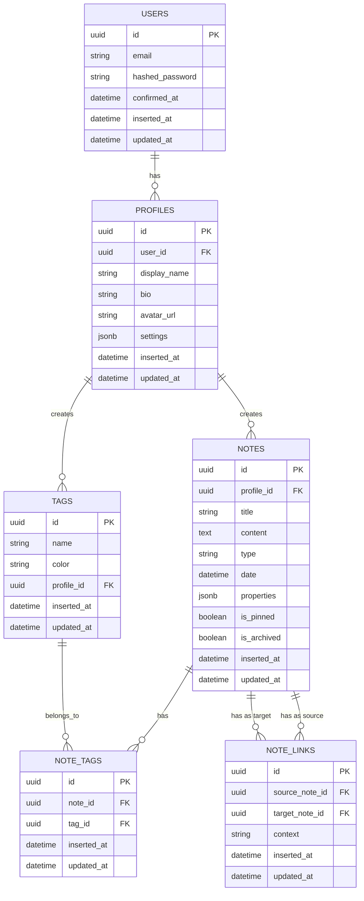

# Kronos Database Schema

## Entity Relationship Diagram

## Schema Details

### Users
- Already implemented for authentication
- Contains basic auth information

### Profiles
- Extends the user model with application-specific information
- One-to-one relationship with Users
- Contains display preferences and settings

### Notes
- Central entity for both notes and journal entries
- Type field differentiates between daily, weekly, monthly, and regular notes
- Properties field (JSONB) allows for flexible metadata storage
- Date field for journal entries (daily, weekly, monthly)

### Tags
- Reusable labels that can be applied to notes
- Each tag belongs to a specific profile

### Note Tags
- Junction table for many-to-many relationship between notes and tags

### Note Links
- Represents bidirectional links between notes
- Can be used for backlinks functionality
- Context field can store information about the nature of the link
